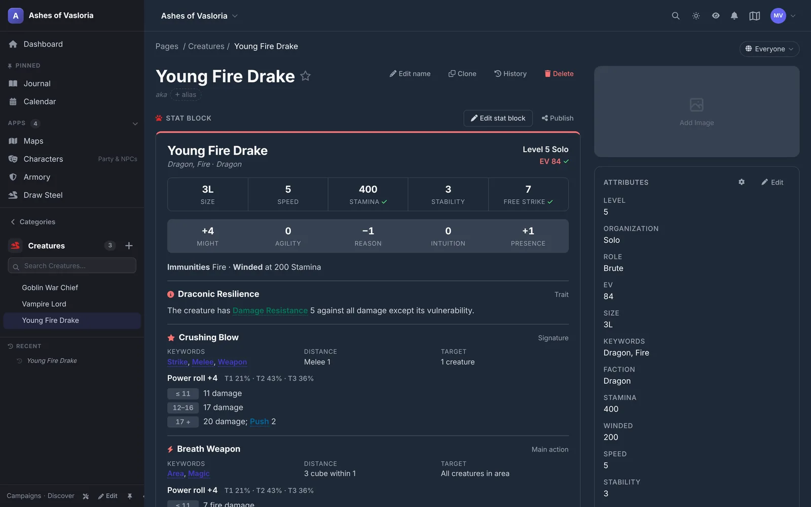
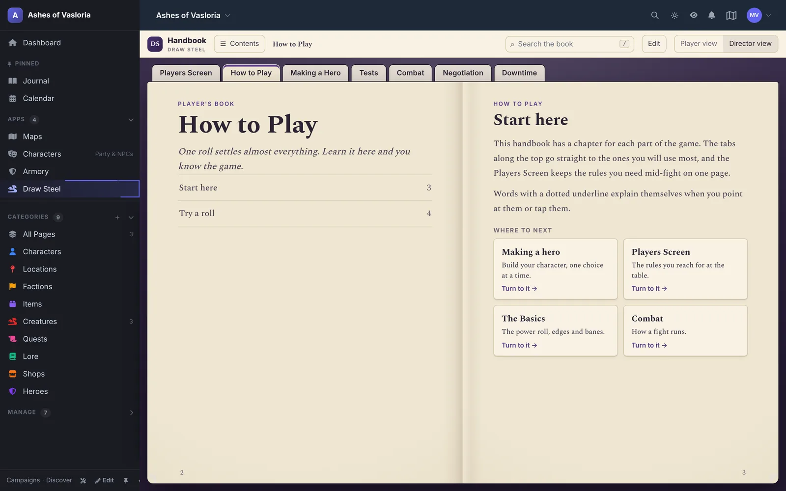

<h1 align="center">Draw Steel for Chronicle</h1>

<p align="center">
  <b>Draw Steel rules, stat blocks and a rulebook inside your <a href="https://github.com/keyxmakerx/Chronicle">Chronicle</a> campaign.</b><br>
  An independent package for MCDM's Draw Steel RPG.
</p>



## What it adds

### Stat blocks on creature pages

Creature and NPC pages get a Draw Steel stat block under the title. Characteristics, abilities with their power-roll tiers, and villain actions are all there, and rules terms explain themselves on hover. The director edits it in place: Encounter Value, Stamina and free strike follow the published formulas, and each figure says whether it came from a formula or from you. The checks panel tells you whether the stat block is filled in. It does not tell you whether the fight is balanced.

### A rulebook players can read

Chronicle's Rules page opens the package as a book you turn the pages of. There is a Player's book and a Director's book, a Players Screen for mid-fight lookups, and chapters on making a hero, tests, combat, negotiation and downtime.



### And the rest

- **Bestiary**: browse and filter the example creatures, then add one to your campaign.
- **Negotiation tracker**: run a negotiation on an NPC page with the published rules for interest, patience, motivations and pitfalls.
- **Hero sheet**: a read-only hero sheet, synced from Foundry VTT.
- **DM Screen**: Stamina, Recoveries, the heroic resource and current conditions for each hero.
- **Page types**: Hero and Creature types whose fields line up with Foundry VTT actors.
- **Reference data**: 519 hero abilities, 12 ancestries, 21 kits, 57 skills, 65 glossary entries and 35 example creatures (written for this package, not MCDM's monsters).

## Install

1. In Chronicle, go to **Admin > Packages** and add `https://github.com/keyxmakerx/Chronicle-Draw-Steel`.
2. Install the latest release.
3. In your campaign, open **Manage > Game & features** and pick **Draw Steel** in the **Game system** card.

Without the package manager, download the release ZIP from GitHub Releases and upload it from **Campaign Settings > Content Packs > Upload System**, then check the validation report.

To update, install the newer release from **Admin > Packages**. Chronicle adds any new sheet fields to campaigns already using Draw Steel. It never brings back a field a GM deleted.

Stat blocks and the negotiation tracker show on pages of the types added under NPCs on the **Characters** page. The type's layout needs the **Game System Panels** block, under the title.

## Contributing

Bug reports and ideas are welcome as [issues](https://github.com/keyxmakerx/Chronicle-Draw-Steel/issues).

<details>
<summary><b>Working on the data and widgets</b></summary>

Every file in `data/` is a JSON array of Chronicle **ReferenceItem** objects. Each one has a `slug`, a `name` and a `source` (the exact string `"custom"` for this package's own entries), plus optional `summary`, `description`, `properties` and `tags`. Schemas are in [`docs/DATA-SCHEMA.md`](docs/DATA-SCHEMA.md).

- Rules cross-references in text use `{@category term}`, for example `{@condition frightened}`. Every term needs an entry in `data/rules-glossary.json`.
- Creature numbers come from `DrawSteelFormulas` in `widgets/monster-engine.js`, the only place the published formulas are evaluated.
- After editing `data/*.json`, run `node tools/build-render-fields.mjs` to regenerate the display fields and the manifest's categories.
- Widgets are ES5 (`var`, no arrow functions), register with `Chronicle.register()`, escape with `Chronicle.escapeHtml()` and inject their own `<style>`.
- `book/` is the Rulebook, in the YAML format from Chronicle's `docs/system-rulebook-book.md`.

```bash
node --test tools/test-*.mjs
```

[`docs/WIDGET-GUIDE.md`](docs/WIDGET-GUIDE.md) covers each widget and [`docs/monster-builder.md`](docs/monster-builder.md) the stat block editor.

Releases come from **Actions > Release > Run workflow** with a version such as `0.13.7`. The Git tag is the version, and Chronicle installs the latest non-prerelease tag.

</details>

## License

This package carries **two** licensing positions, because it contains two kinds of
material. See [LICENSE](LICENSE) for the full statement and
[data/NOTICE.md](data/NOTICE.md) for the file-by-file attribution.

**The Draw Steel rules text in `data/`** (glossary, skills, ancestries, kits,
abilities, ability keywords, the ancestry point-buy, the monster-making and
encounter-building formulas, the animal traits, and the negotiation rules) is reproduced under MCDM's
**DRAW STEEL Creator License**. It is *not* Creative Commons material: MCDM has not
released Draw Steel under any CC licence, and there is no Draw Steel SRD.

> This package is an independent product published under the DRAW STEEL Creator
> License and is not affiliated with MCDM Productions, LLC.
> **DRAW STEEL © 2024 MCDM Productions, LLC.**

No MCDM trademarks, logos, art, or setting material are reproduced here, only rules
text and its mechanical numbers. MCDM endorsement is not implied. This package cannot
sublicense that text; anyone redistributing it relies on the same Creator License and
must carry the same attribution.

**This package's own work** (`widgets/*.js`, `tools/*.mjs`, `docs/*`, `manifest.json`,
and the data entries flagged `"source": "custom"`, including the 35 example creatures in
`creatures.json`) is licensed **CC-BY-4.0**, © the Chronicle Draw Steel contributors.

**A limitation worth knowing about:** the Creator License text itself could not be read
from the environment this position was written in (`mcdmproductions.com` is unreachable
there). The statements above rest on this repository's established position and on the
community Steel Compendium's reliance on the same licence for the same material, not on
a reading of the licence. A human should read it once and confirm. See the closing
section of [LICENSE](LICENSE).

<sub>Screenshots are from a demo campaign running Chronicle with this package.</sub>
