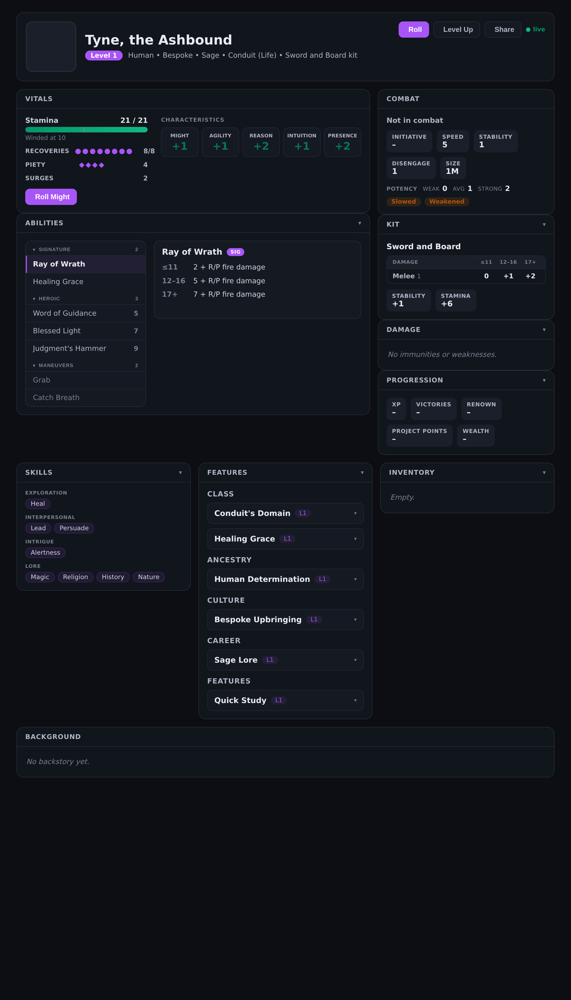

# Draw Steel Character Sheet — Design Decisions & Roadmap

> The single source of truth for the hero character-sheet widget
> (`widgets/character-sheet.js`). Read this before redesigning anything so we
> don't relitigate settled decisions. Updated as decisions are made.

## 🧪 Testing (no live client needed)

The widget's pure logic — the "For \<hero>" odds (`tierOdds`), damage-formula
resolution (`substituteFormula`/`tierFragments`), ability grouping (`groupOf`), the
feature-origin classifier (`classifyFeature`), skill grouping, and the label
humanizers — is unit-tested in `tools/test-character-sheet.mjs`
(`node --test tools/test-character-sheet.mjs`). The widget is a browser IIFE that
exports these helpers via `module.exports` off-browser (the `Chronicle.register`
side-effects are guarded on a null `Chronicle`), so Node can import and test them
with zero change to runtime behavior. Visuals are checked by rendering the **real**
widget headlessly against mock data (see the scratch `ability-harness`).

## 📸 Reference renders

Headless renders of the **real widget** (not mockups) against mock Phase-C data —
update these when the design changes.

| | |
|---|---|
| Full sheet (all sections) | `docs/images/character-sheet-full.png` |
| Ability card — expanded ("For \<hero>" odds) | `docs/images/ability-card-expanded.png` |
| Ability rail — long list (filter + collapsed Maneuvers) | `docs/images/ability-rail-long-list.png` |

---

## ✅ DONE (shipped / merged / on-branch)

- **Phase A data fixes** (manifest) — corrected wrong `foundry_path`s and added an
  ability projection. **Confirmed live**: a re-synced hero now shows `Level 1`,
  `Conduit (Life)` (class + subclass collapsed to names), the `PIETY` heroic-resource
  label, and the full ability list. See `FOUNDRY-SYNC-MAP.md`.
- **v3 sheet scaffold** — always-render sections, graceful placeholders, responsive.
- **v3.1 polish** — violet accent (overridable `--ds-accent`), composite Vitals box
  (stamina + recovery dots + HR pips + Roll), characteristics grid, Combat box, GM Lore.
- **v3.2 affordance** — collapsible boxes read as clickable (hover lift, caret).
- **Operator diagnostics workspace** + sync-map doc (debugging "where data dies").
- **Foundry dashboard** — reliable reopen + "Sync Everything Now" (journals +
  linked characters + maps).
- **Phase C sync expansion** (manifest + Foundry adapter) — the adapter now
  normalizes Foundry Sets & pseudo-document collections to JSON
  (`normalizeFoundryValue`), and the manifest projects ability keywords / tier
  ladder (`system.power.effects`) / power-roll characteristics / effect text,
  plus skills, kit details, culture, career, conditions (`actor.statuses`) and
  potency. Needs a Draw Steel release + a hero re-sync to flow live.
- **Ability section build** — the bare Option-D master–detail (below) is built
  in `character-sheet.js`: grouped rail (Signature/Heroic/Maneuvers), the
  even-smaller bare card (auto-selected, hover lifts+glows), click-grows to the
  two-section big card (① rules ② "For \<hero>" computed odds), glossary refs,
  responsive stack. Verified headlessly against the real widget + mock Phase-C
  data (scratch `ability-harness`). **Caveat:** tier-line text for *non-damage*
  power-roll effects depends on the live `system.power.effects` shape — damage
  effects render cleanly now; other effect types fall back to the ability's
  effect text until confirmed against a live re-sync.

---

## 🎯 AGREED ABILITY-SECTION DESIGN (the model we settled on)

The Abilities section is the focus of the next build. **FINAL LOCKED SHAPE** (settled
after extensive mock iteration — do NOT redesign; see scratch mocks `ledger-bare2`):

1. **Bare master–detail ("Option D"), monochrome.** A grouped list (master) + a detail
   pane. The aesthetic is **minimal/restrained**: dark grayscale with a SINGLE violet
   accent only (SIG badge, selected-row edge, glossary links). **No color-coded tier
   bands, no action glyphs, no gradient chrome** in the resting/default views.
   - **List** — plain rows: name + cost, grouped (Signature / Heroic / Maneuvers). The
     selected row gets a subtle accent left-edge; maneuvers/free-strikes are dimmed.
   - **Resting** (nothing selected) — the pane shows a quiet **"Select an ability"** prompt.
2. **Two zoom levels in the detail pane — and NO expand button:**
   - **Default = an even-smaller BARE card.** Click a list row → the pane fills with a
     small card: header line (name · `Sig` · cost) + three **plain** tier lines
     (≤11 / 12–16 / 17+), glossary `{@terms}` in accent. That's it — no color bands,
     no footer note, no button.
   - **Hover the card → it lifts + glows** (a transform/shadow animation) to signal it's
     clickable, with a faint "click to expand" hint. The **whole card is the click target.**
   - **Click → it grows into the bigger card via animation** (the two-section card below).
3. **The grown (big) card has TWO sections:**
   - **(1) General info** — the rules, identical for everyone (keywords, distance,
     target, power-roll characteristics, the tier ladder text).
   - **(2) Character-specific ("For \<hero>")** — computed for *this* hero. The rules
     audit (✅ done) locked the spec. Power roll = `2d10 + characteristic` (the ability's
     named one, or the higher when it says "X or Y"); tiers ≤11 / 12–16 / 17+ compared to
     the final total; **nat 19–20 = auto Tier 3**. Show these four STATIC, ship-now values:
     1. **Roll expression** — `2d10 + N (Characteristic)` using the hero's best applicable.
     2. **Resolved per-tier damage** — substitute the hero's characteristic into each tier's
        `base + C`, plus the **kit** bonus per tier (melee bonus if Melee+Weapon, ranged if
        Ranged+Weapon). *Headline value.* (Kit/keywords need Phase C; ship the `+C` part now.)
     3. **Average → tier** — `11 + mod` → band (e.g. +2 → 13 → Tier 2).
     4. **Tier odds** — `T1 % / T2 % / T3 %` from a precomputed `mod → distribution` lookup,
        with the nat-19/20 auto-Tier-3 floor folded in.
     - **Affordability** (`cost vs current resource`) is gated — current resource is live
       combat state, not static sheet data → render only when present.
     - **Do NOT compute**: hit/miss vs defenses (no AC in DS), target state, edges/banes
       (situational). These make the card wrong more often than right.
4. **Grouping** — the character's class/signature abilities up top; the universal
   maneuvers / free strikes / basic actions in a **collapsed/dimmed** group below
   (Foundry hands over ~21 ability items including universal ones).
5. **Glossary lookup card** (the small `{@term}` definition popover) — inside ANY card,
   rule terms like `{@condition slowed}` / `{@move shift}` render as dashed-underlined,
   **category-color-coded** links (Condition = amber, Movement = blue, Resource = purple,
   Duration/Action/Combat = their own tints). Hover (desktop) / tap (mobile) → a SMALL
   floating definition card: the term **name** + a **category chip** + its **definition**
   + a "Draw Steel · \<category>" source line. Pulled from `data/rules-glossary.json` via
   `widgets/reference-renderer.js`. Self-contained (never reflows the sheet); the same
   lookup works everywhere `{@…}` appears (ability text, features, lore). This is a
   distinct, smaller popover from the ability card — it explains *what a word means*.
6. **Sizing — keep the cards NARROW.** The detail cards (small AND grown) are
   **width-constrained** (≈ max-width 520–560px), left-aligned in the detail pane — they
   do NOT stretch to fill the whole pane/column. ("Too wide" was the note; a tight card
   reads better and matches the bare aesthetic.)
7. **Responsive** — desktop = split (list + detail); mobile = the list, and tapping
   opens the small→grown card as a **bottom drawer**.
8. **Long lists ("tons in the list").** A hero carries their whole kit *plus* every
   universal maneuver (~21 rows), so the rail must not sprawl. Three measures, all in
   the bare aesthetic (✅ built):
   - **Capped scroll** — the rail is a fixed-max-height (~460px) scroll area, so the
     list scrolls *inside itself* and never shoves the detail pane down, no matter the
     count.
   - **Collapsible groups** — each group header is a toggle (caret + a count badge);
     on a **long list (≥10)** the dim **Maneuvers** group starts **collapsed** (its ~16
     universal actions folded away), Signature/Heroic stay open. Click any header to
     fold/unfold.
   - **Filter box** — a sticky "Filter abilities…" input appears on long lists; typing
     narrows rows live, hides emptied groups, and force-opens collapsed groups so a
     match inside Maneuvers still surfaces.

---

## 🧩 THE OTHER SECTIONS (each UI fit to its data — NOT a cloned ability card)

Phase C syncs far more than abilities; every field gets a renderer shaped to its
content (✅ built). The principle: *vary the UI by what the data is.*

- **Skills** (own box) — trained skills as compact chips **grouped by the five Draw
  Steel skill groups** (Crafting / Exploration / Interpersonal / Intrigue / Lore),
  mirroring the official sheet; ids humanized (`handleAnimals` → "Handle Animals"). An
  unknown id lands in an "Other" bucket rather than vanishing. (Hardcoded group map in
  the widget; a `data/skills.json` catalog is the eventual home if it needs to drift.)
- **Kit** (own box) — a **stat box**: the melee/ranged damage-tier mini-ladder
  (≤11 / 12–16 / 17+) + flat bonus chips (stability / speed / stamina / disengage). Kit
  is reference stats, so it is NOT a clickable card.
- **Origin** — Culture + Career fold into the header subtitle line
  (ancestry · culture · career · class (subclass) · kit).
- **Vitals** — Surges as a statline alongside the heroic-resource pips.
- **Combat** — Size + Disengage chips, plus a compact **Potency strip** (weak / avg /
  strong thresholds); conditions render Title-cased from the `actor.statuses` ids.
- **Damage / Progression** — existing chip layouts (immunities/weaknesses;
  xp/victories/renown/wealth) now actually fed by Phase C paths.

- **Features** (own box) — ✅ built as a **defensive framework**, because Foundry stores
  class/ancestry/kit/culture/career features all as generic `feature` items and a feature
  does **not** record which item granted it (`system.source` is the publication book).
  So instead of trusting one field: `features_json` projects every feature
  (name / description / level / `_dsid` / source book), and the renderer **classifies**
  each by matching its `_dsid`/name against the hero's KNOWN origin names (class, ancestry,
  kit, culture, career — already synced), bucketing into those groups. Anything it can't
  place lands in a generic **Features** group; if *nothing* classifies, it renders ONE flat
  list rather than fake headers. Each feature is a native `
` accordion (name +
  level → description on expand), so a long list collapses with zero JS. The classifier is
  a heuristic — it tightens once live data shows which signal truly carries the origin, but
  it already works (ungrouped at worst). Legacy `*_features_json` kept as a fallback.

---

## 📣 LIVE FEEDBACK — 2026-06-28 (first real synced hero "Saatraaol")

Phase C is **live and validated**: a real hero renders class/culture/career/subclass/
kit, abilities with tiers + the computed "For \<hero>" odds, grouped skills, kit
details, and grouped features. Five issues to fix (tracked as tasks #45–#49):

1. **Foundry enricher syntax shows raw (ROOT CAUSE of several).** Synced ability/
   feature text contains **Foundry** enrichers — `[[/surge 1]]`,
   `[[lookup @hero.victories]]{your Victories}`, `[[/gain 1d3 hr]]{gain 1d3 insight}`
   — which render as literal junk. We strip HTML tags but NOT these. Fix: a
   `cleanFoundryText()` that turns `[[…]]{label}` → `label` and `[[…]]` → a cleaned
   command word, applied to features, ability effect text, and backstory. (#45)
2. **Features are a mess / huge.** Expanded a feature (e.g. *Insight*) dumps a giant
   wall of text (full of #1's raw enrichers). Fix: clean the text AND clamp it —
   teaser + "read full" (reuse the backstory reading-view overlay) or a max-height
   scroll — so opening one doesn't blow out the column. (#46)
3. **Backstory shows raw `
`.** The Foundry biography is HTML; `rNotes` teaser and
   the reading-view overlay show the tags literally. Fix: run backstory through
   `htmlToText`/clean in BOTH places. (#47)
4. **No glossary defs on real heroes.** The `{@condition slowed}` tooltips only fire
   on **Chronicle-authored** `{@category term}` text — but **synced Foundry text has
   none of that syntax** (it uses `[[…]]`). So zero tooltips show live. Fix (after #1):
   scan the *cleaned* text for known DS glossary terms (conditions, keywords) and wrap
   them as ref tooltips, and **populate `data/rules-glossary.json`** with the DS
   conditions + keyword defs (currently sparse/empty). (#48)
5. **Skills want definitions.** Skills are bare name chips; a player can't tell what
   "Alertness" does. Fix: add a `data/skills.json` catalog (slug/name/group/**description
   from the Draw Steel rules**) and a small hover/tap definition card per skill (same
   popover pattern as the ability glossary). Needs the DS rulebook skill text. (#49)

> **Note for future sessions (don't re-derive):** the sheet renders **Foundry** rich
> text, whose enricher syntax is `[[command args]]{display}` and `@UUID[...]{label}` —
> NOT Chronicle's `{@category term}`. Any "why isn't the glossary working / why is there
> raw markup" question traces back to this mismatch.

**Status:** #45/#46/#47 ✅ shipped (enricher/HTML cleanup + feature clamp + backstory).
#48/#49 in the plan below (now UNBLOCKED — see the glossary source).

---

## 🧭 PLAN & DECISIONS — 2026-06-28 (after the Saatraaol review)

**Purpose of the sheet (sets priorities):** it is primarily a **DM reference** — so a
director can look up a player's abilities/stats/defenses while **building monsters**
(the monster builder) or writing notes. ⇒ favor **data completeness** over
interactivity. Rolls etc. are a someday-thing.

**Decisions (locked with the user):**
- **Action buttons** (Roll / Level Up / Share / Roll Might) — stay as visible
  "construction tape"; clicking shows a transient *"coming later"* toast. No rolling
  for the foreseeable future (no roll endpoint in the read-only contract anyway).
- **Combat-tracker fields** (initiative / in-combat / round) — **dropped from the
  sheet.** Draw Steel uses **alternating activation** (no initiative roll); turn order
  belongs on the **Character viewer page**, not the reference sheet.
- **Treasures** — **yes, surface them.** DS Treasures are the magic-item system (one
  Foundry `treasure` item type, `category` = consumable | trinket | leveled | artifact;
  + kind / echelon / keywords / quantity). They change what a hero can DO in a fight, so
  they're high DM-reference value. Render grouped by category.
- **Write-back (Chronicle → Foundry)** — a **careful FUTURE epic**, not now. Scope:
  notes/backstory first; **items only when fully synced**; on a sync failure, notify the
  **player** lightly ("this item isn't synced") and the **owner** with detail, and emit
  an **error dump into the AI diagnostics workspace** (the operator batch tooling). Until
  built, the contract is **one-way read-only mirror** (Foundry is source of truth).
- **Glossary + skills source** — build from **steelcompendium.io** (GitHub org
  `SteelCompendium/data-md`): current DS **1.0** ruleset, machine-extractable Markdown+
  YAML, **no scraping**. Licensed under MCDM's **Draw Steel Creator License** — quoting
  rules text in our open-source `data/*.json` is permitted **provided** we include the
  verbatim DSCL attribution `NOTICE` and don't imply MCDM endorsement. Pin a commit SHA.
  Conditions (9) + skills (~55, grouped, with descriptions) come out cleanly; ability
  **keywords** (Magic/Melee/Ranged/Weapon/Strike/Area/Charge…) are NOT discrete files →
  curate ~10–15 by hand once.

**DM-reference completeness gaps to add (from the model audit), priority order for a
DM building a monster:**
1. **Movement modes** — `system.movement.types` (Set: walk/climb/swim/fly/burrow/
   teleport) + `system.movement.hover` (bool). We only show a flat Speed today.
2. **Defenses / save** — `system.combat.save.threshold` (default 6) + `.bonus`.
3. **Damage immunity/weakness VALUES per type** (+ blanket `all`) — currently we read
   only `.all` and drop the magnitude; project the whole `system.damage.{immunities,
   weaknesses}` objects.
4. **Status/condition immunities** — `system.statuses.immunities` (Set).
5. **Treasures** (above). 6. **Perks** (`perk` item, `perkType`). 7. **Titles**
   (`title` item, extends feature, has echelon/story). 8. **Languages**
   (`system.biography.languages` — an actor field, syncs like skills, not an item).
   9. Triggered reactions called out as a group + reach as a top-line stat.

**Execution batches:**
- **Step 2 (done in this batch):** dead-button toast; drop combat-tracker placeholders;
  HR as a bare count (DS HR has no max); `rDamage` tolerant of CSV/object/number shapes;
  removed dead `project_points` chip + dead box registrations (`ds-characteristics`/
  `-heroic-resource`/`-movement`) + dead `heroic_resource_max`; stale-docstring + doc fix.
- **Step 3:** the DM-reference completeness projections + renders (1–9 above).
- **Step 4:** generate `data/rules-glossary.json` + `data/skills.json` from Steel
  Compendium (+ DSCL `NOTICE`), the enricher-aware term-scanner (#48), and the per-skill
  definition cards (#49).

## 🛠️ WANT TO DO (planned, not yet built)

- ~~Build the ability section~~ — ✅ **DONE** (bare Option-D master–detail + long-list
  handling + click-to-collapse).
- ~~Rules audit~~ / ~~"For \<hero>" math~~ — ✅ **DONE** (unit-tested).
- ~~Phase C sync expansion~~ (keywords / tier ladder / skills / kit / culture-career /
  conditions) — ✅ **DONE**.
- **Remaining sync** — Treasures/inventory, perks, titles, languages, movement modes,
  save, per-type damage values, status immunities. See the PLAN above (Step 3).
- **Glossary + skills definitions** — Step 4 (Steel Compendium source).

---

## 🚫 DO NOT WANT (explicitly rejected — don't re-propose)

- **Hover-to-open** the main ability card — there are too many abilities; the main card
  opens on **click**, not hover. (Hover is reserved for the small glossary tooltips.)
- **Inline accordion dropdowns** for ability detail (the old v3 behavior) — replaced by
  the detail pane / expand card. "Actions shouldn't be dropdowns."
- **The full C statblock as the default detail** — too heavy. C is **opt-in** via the
  expand action only; the default detail stays compact/at-a-glance.
- **A big always-expanded ability wall** (every ability fully rendered at once).
- **Actions rendered as dropdown menus.**

---

## ❓ OPEN QUESTIONS (decide before/at build time)

- **Empty state** of the detail pane: a "Select an ability" prompt, **or** auto-open the
  first/most-used ability so it's never blank? (Leaning: auto-open.)
- **Generic maneuvers** — collapse/dim them (current plan) vs. hide them entirely?
- Outcome of the **rules audit** → final shape of the character-specific card section.

---

*Mocks that informed these decisions live in the working scratchpad
(`ability-options`, `ability-zoom`, `ability-hybrid-*`, `glossary-hover`).*
