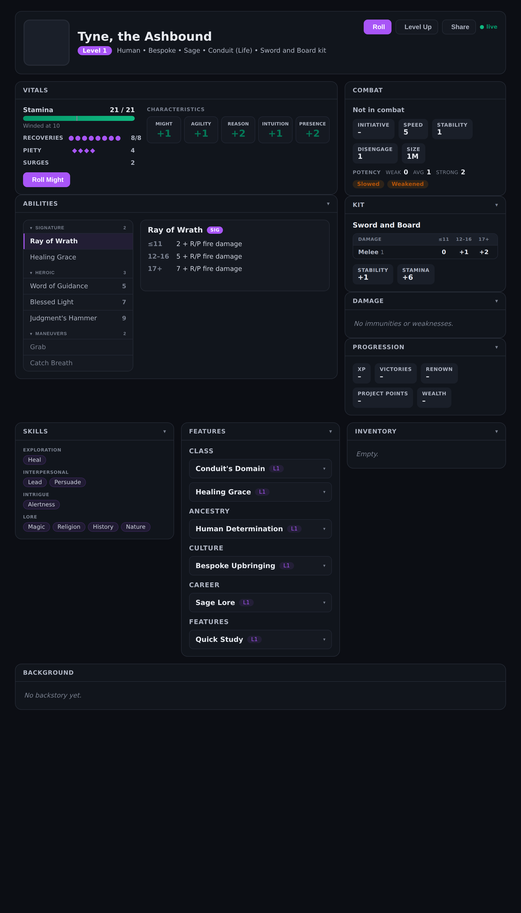

# Draw Steel Character Sheet — Design

> The reference for the hero character-sheet widget (`widgets/character-sheet.js`).
> It records what the sheet does and why, so a redesign starts from the reasons
> rather than relitigating them. The field paths it reads are in
> `docs/FOUNDRY-SYNC-MAP.md`.

## Purpose

The sheet is a **read-only DM reference**: a director looks up a player's abilities,
stats and defenses while building monsters or writing notes. That favors **data
completeness** over interactivity. The data is a one-way mirror; Foundry is the source
of truth and nothing on the sheet writes back.

## Testing

The widget's pure logic — the "For \<hero>" odds (`tierOdds`), damage-formula
resolution (`substituteFormula`/`tierFragments`), ability grouping (`groupOf`), the
feature-origin classifier (`classifyFeature`), skill grouping, and the label
humanizers — is unit-tested in `tools/test-character-sheet.mjs`
(`node --test tools/test-character-sheet.mjs`), with the arithmetic evaluator in
`tools/test-arith-evaluator.mjs` and escaping in `tools/test-character-sheet-xss.mjs`.
The widget is a browser IIFE that exports these helpers via `module.exports`
off-browser (the `Chronicle.register` side-effects are guarded on a null `Chronicle`),
so Node can import and test them with zero change to runtime behavior. Visuals are
checked by rendering the real widget headlessly against mock data.

## Reference renders

Headless renders of the real widget against mock data, to be refreshed when the
design changes.

| | |
|---|---|
| Full sheet (all sections) | `docs/images/character-sheet-full.png` |
| Ability card — expanded ("For \<hero>" odds) | `docs/images/ability-card-expanded.png` |
| Ability rail — long list (filter + collapsed Maneuvers) | `docs/images/ability-rail-long-list.png` |

---

## Layout

The sheet is a Chronicle surface of boxes. Sections that hold no data still render,
with a muted placeholder, so the structure is visible on a sparse hero.

1. **Header** — portrait, name, and one origin line (ancestry · culture · career ·
   class (subclass) · kit), with status pills (claimed by you, visibility) and the
   inert Roll / Level Up / Share buttons.
2. **Main column** — Vitals (stamina, recoveries, heroic resource, surges, the five
   characteristics, Roll Might) and Abilities.
3. **Side column** — Combat, Kit, Damage, Progression.
4. **Lists row** — Skills, Features, Inventory.
5. **Background** — the player-private backstory, shown only to the GM and the
   claiming owner.
6. **GM Lore** — the director's notes, shown only to a GM.

Background and GM Lore are gated by who is viewing, not by whether data exists, so a
teammate never sees an empty "No backstory yet." placeholder for a hero that has one:
the box is not scheduled at all.

---

## Abilities section

**Shape: bare master–detail, monochrome.** A grouped list (master) plus a detail pane.
The look is minimal and restrained: dark grayscale with a single violet accent (the
Sig badge, the selected-row edge, glossary links). There are no color-coded tier
bands, no action glyphs and no gradient chrome in the resting views.

1. **List** — plain rows: name plus heroic-resource cost, grouped Signature / Heroic /
   Maneuvers, and ordered by cost within a group. An ability is Signature or Heroic
   by its category, Heroic also when it has a cost, and a Maneuver otherwise. The
   selected row gets a subtle accent left edge; maneuvers are dimmed.
2. **Resting pane** — with nothing selected the pane shows a quiet "Select an
   ability" prompt rather than auto-opening one.
3. **Two zoom levels, no expand button.**
   - **Small card (default).** Clicking a row fills the pane with a bare card: a
     header line (name · `Sig` · cost) and three plain tier lines (≤11 / 12–16 / 17+)
     with glossary `{@terms}` in accent. When no tier ladder can be derived (a
     non-damage effect) it shows the power-roll line and a teaser of the effect.
   - **Hover** lifts and glows the card, with a faint "click to expand" hint. The
     whole card is the click target (Enter and Space work too).
   - **Click** swaps in the big card; its close button or Escape returns to the small
     card.
4. **The big card has two sections.**
   - **① The rules** — identical for everyone: keywords, distance, target,
     power-roll characteristics, the tier ladder, trigger and effect text.
   - **② For \<hero>** — computed for this hero, and shown only when the ability has
     power-roll characteristics and the hero's matching characteristic is synced:
     1. **Roll expression** — `2d10 + N (Characteristic)` using the hero's best
        applicable characteristic.
     2. **Average → tier** — `11 + N`, mapped to its tier.
     3. **Tier odds** — T1 / T2 / T3 percentages by enumerating all 100 outcomes of
        2d10, with a natural 19–20 counted as Tier 3.
     4. **Resolved per-tier damage** — the characteristic substituted into each
        tier's damage formula and evaluated.
   - **Not computed:** hit or miss against defenses (Draw Steel has no AC), target
     state, edges and banes (situational), affordability against the current
     resource (live combat state, not sheet data), and the kit's per-tier damage
     bonus (shown on the Kit box, not folded into the ability). These would make the
     card wrong more often than right.
5. **Glossary lookup.** Rule terms such as `{@condition slowed}` render with a dotted
   underline in their category color, and bare condition names in synced prose are
   wrapped the same way. Hovering or focusing a term opens a small dark tip box with
   its definition. Ability keyword badges and skill chips use the same tip box. It
   never reflows the sheet, and it is hover and focus only (there is no tap
   behavior). Definitions come from `data/rules-glossary.json` and
   `data/skills.json` through `widgets/reference-renderer.js`.
6. **Narrow cards.** The small card is at most 420px wide and the big card 520px,
   left-aligned in the pane, rather than stretched across it. A tight card reads
   better and matches the bare look.
7. **Responsive.** On a wide screen the list and pane sit side by side. At 680px and
   narrower the list stacks above the pane and the cards fill the width.
8. **Long lists.** A hero carries their whole kit plus every universal maneuver
   (about 21 rows), so the rail must not sprawl:
   - **Capped scroll** — the rail is a fixed-max-height (460px) scroll area, so the
     list scrolls inside itself and never shoves the pane down.
   - **Collapsible groups** — each group header is a toggle with a caret and a count
     badge. On a long list (10 or more abilities) the dimmed Maneuvers group starts
     collapsed; Signature and Heroic stay open.
   - **Filter box** — a sticky "Filter abilities…" input appears on long lists;
     typing narrows rows live, hides emptied groups and force-opens collapsed ones so
     a match inside Maneuvers still surfaces.

---

## The other sections

Every field gets a renderer shaped to its content: vary the UI by what the data is.

- **Skills** — trained skills as compact chips grouped by the five Draw Steel skill
  groups (Crafting / Exploration / Interpersonal / Intrigue / Lore), mirroring the
  official sheet, ids humanized (`handleAnimals` → "Handle Animals"). An unknown id
  lands in an "Other" group rather than vanishing; languages follow as their own
  group. The group map is hardcoded in the widget.
- **Kit** — a stat box: the melee and ranged damage-tier mini-ladder
  (≤11 / 12–16 / 17+) plus flat bonus chips (stability / speed / stamina /
  disengage). Kit is reference stats, so it is not a clickable card.
- **Vitals** — Surges as a statline beside the heroic-resource count. A heroic
  resource has no maximum, so it is a bare count with one accent pip.
- **Combat** — Speed, Stability, Disengage, Size and Save chips, movement-mode badges
  (fly, climb, swim, burrow, teleport, hover), a compact Potency strip (weak / avg /
  strong), and condition pills Title-cased from the `statuses` ids. Initiative,
  in-combat and round are not shown: Draw Steel uses alternating activation (no
  initiative roll), and turn order belongs on the Character viewer page.
- **Damage** — damage immunities and weaknesses, plus the conditions the hero is
  immune to.
- **Progression** — XP, victories, renown, wealth.
- **Inventory** — Treasures, then the hero's linked item pages. Treasures are Draw
  Steel's magic-item system (one Foundry `treasure` item type with a category of
  consumable, trinket, leveled or artifact, plus kind, echelon, keywords and
  quantity). They change what a hero can do in a fight, so they carry high reference
  value; they render grouped by category, each an accordion when it has a description.
- **Features** — built as a defensive framework. Foundry stores class, ancestry, kit,
  culture and career features all as generic `feature` items, and a feature does not
  record which item granted it (`system.source` is the publication book). So instead
  of trusting one field, `features_json` projects every feature (name, description,
  level, `_dsid`, source book) and the renderer classifies each by matching its
  `_dsid` or name against the hero's own class, subclass, ancestry, culture, career
  and kit names, bucketing into those groups. Anything it can't place lands in a
  generic "Features" group; if nothing classifies, it renders one flat list rather
  than fake headers. Perks and Titles follow as their own groups. Each feature is a
  native `
` accordion (name and level, description on expand), so a long list
  collapses with no JS. The classifier is a heuristic: at worst it leaves features
  ungrouped.
- **Background** — a teaser line and a "Read full story" button that opens a typeset
  reading view, so large lore doesn't accordion-shove the sheet.

## Inert actions

Roll, Level Up, Share and Roll Might stay visible as placeholders ("construction
tape"). Clicking one shows a transient "coming later" toast. There is no roll endpoint
in the read-only contract, so nothing on the sheet rolls dice.

## Glossary and skills source

The glossary and skills are built from steelcompendium.io (GitHub org
`SteelCompendium/data-md`): the Draw Steel 1.0 ruleset as machine-extractable
Markdown and YAML, with no scraping. It is licensed under MCDM's **Draw Steel Creator
License** — quoting rules text in our open-source `data/*.json` is permitted
**provided** we include the verbatim DSCL attribution `NOTICE` and don't imply MCDM
endorsement. (That is this project's position, not a checked reading of the licence:
see the caveat in `data/NOTICE.md` and #53.)

`data/skills.json` (57 skills) and the ability-keyword entries in
`data/rules-glossary.json` come from the Steel Compendium under the DSCL
(`data/NOTICE.md`). Ability keywords are not discrete files at the source, so the
keyword entries were curated by hand. Skill chips and keyword badges show definition
tips; `reference-renderer.scanText()` and `refSynced()` wrap bare condition names in
synced prose, so the glossary fires on real heroes. Only conditions are auto-scanned,
not movement terms.

## Do not want

Explicitly rejected; don't re-propose:

- **Hover-to-open** for the main ability card — there are too many abilities. The big
  card opens on click; hover is reserved for the small glossary tips.
- **Inline accordion dropdowns** for ability detail — replaced by the detail pane and
  expand card. Actions shouldn't be dropdowns.
- **The full statblock as the default detail** — too heavy. The big card is opt-in via
  the expand click; the default detail stays compact.
- **A big always-expanded ability wall** (every ability fully rendered at once).
- **Actions rendered as dropdown menus.**
